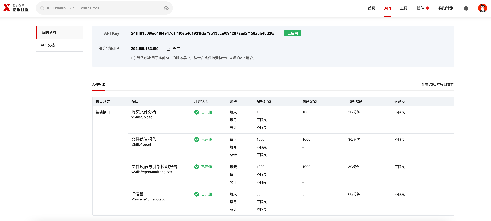
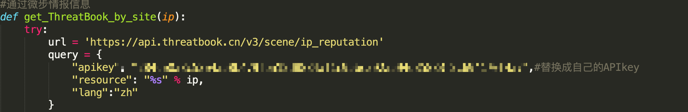

## #TrackAttacker V1.1

### 前言 ###
```
拿到这个脚本我真的是太开心了，但发现没有微步的查询，于是去看了微步查询的api，参考了一些微步api开发的blog。
进行了简单的微步信息采集，判断是否为恶意IP，同时把微步标签打出来，这样更方便快速的对我们要进行溯源的IP划分优先级。

```

------
### 增加功能 ###

```
1：微步信息查询（恶意与否、标签、场景等）
```

### 目前满足的功能

```
1：IP批量
2：IP查域名
3：IP查地址
4：IP查端口
5：IP查主机名
6：域名查备案
7：域名查Whois
8：微步信息查询（恶意与否、标签、场景等）
```

### 前提要求 ###

1、到微步社区登陆，找到API管理，增加绑定IP



2、复制APIkey到代码中



3、备案查询cookie设置

```
域名查备案用的备案8的接口，该接口需在脚本里手动配置个cookie,so,如果想用该接口，
访问 https://www.beian88.com/, 抓取cookie:eid=b2d7c4b290e086176cdb0ccfbfc162ba，放入脚本中的header头，才可调用域名查备案接口
Why一定通过备案8来域名查备案呢，经过测试，目前发现备案8的接口数据库最广泛，考虑到精准性，最终使用了备案8的接口
```


### Install ###

```
python3 -m pip install -r requirements.txt
```

### 开始使用 ###

urls.txt放入需扫描ip

加all参数=加端口扫描（需要在系统环境中安装nmap）

```
python3 TrackAttacker.py3
python3 TrackAttacker.py3 all
```

### 备注

可惜的是每天只能进行50个ip的扫描，对于hvv每天的大量攻击，实用性说实话一下不高了，不过好在没了之后也还能用其他功能。


### 原地址：[TrackAttacker V1.0](https://github.com/Bywalks/TrackAttacker)

